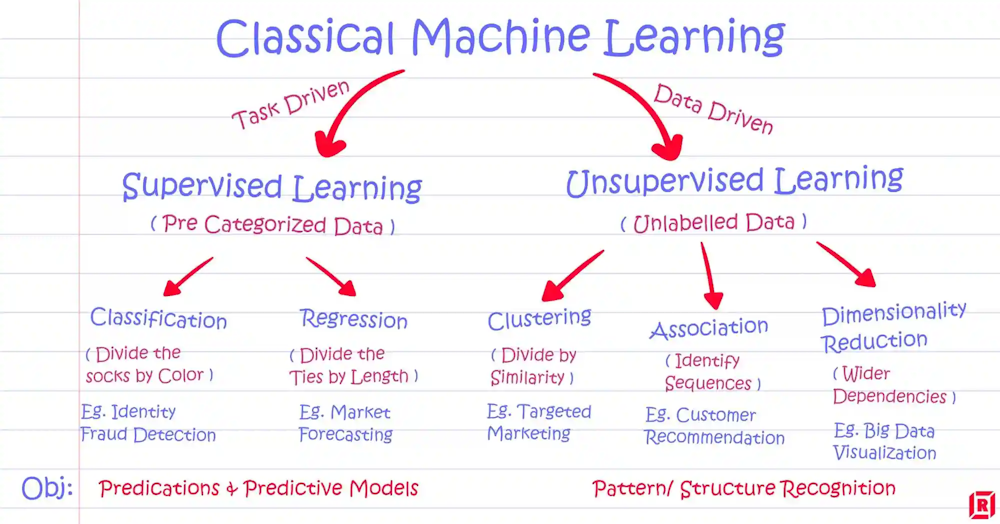

# Unsupervised Learning Exercises

## Introduction to Unsupervised Learning

- **Types of Machine Learning Problems**
  - **Supervised Learning**: Learning from labeled data (e.g., classification, regression).
  - **Unsupervised Learning**: Learning from unlabeled data (e.g., clustering, dimensionality reduction).
  - **Reinforcement Learning**: Learning through feedback to maximize rewards (e.g., game playing, robotics).

- **Importance of Unsupervised Learning**
  - Leverages large amounts of unlabeled data.
  - Discovers hidden patterns.
  - Useful for preprocessing in supervised learning.

- **Goals of Unsupervised Learning**
  - **Dimensionality Reduction**: Simplify data visualization and analysis.
  - **Clustering**: Group similar data points.
  - **Data Visualization**: Aid understanding through visual representations.
  - **Data Preprocessing**: Prepare data for other tasks.
  - **Feature Learning**: Discover useful representations.
  - **Anomaly Detection**: Identify outliers.

## Dimensionality Reduction

- **Overview**
  - Reduces the number of variables for simpler models and visualization.
  - Common techniques: PCA, t-SNE, LDA.

- **Principal Component Analysis (PCA)**
  - **Methodology**: Calculate covariance matrix, determine eigenvectors and eigenvalues, project data.
  - **Choosing Components**: Use variance explanation, elbow method, scree plot.
  - **Applications**: Data visualization, noise reduction, feature extraction.
  - **Principal Component Regression (PCR)**: Use principal components in regression models.
  - **Face Recognition**: Use eigenfaces for efficient representation and recognition.

## Clustering

- **Overview**
  - Groups objects to discover data structure and patterns.

- **Applications**
  - **Marketing**: Customer segmentation, product recommendations.
  - **Healthcare**: Disease subtype discovery.
  - **Information Retrieval**: Document clustering.
  - **Computer Vision**: Image segmentation.

- **Popular Methods**
  - **K-means**: Iterative assignment and update of cluster centroids.
  - **Hierarchical Clustering**: Agglomerative and divisive methods, linkage types, dendrograms.

- **Similarity Metrics and Feature Scaling**
  - Metrics: Euclidean, Manhattan, Cosine similarity, Jaccard index.
  - Scaling: Standardization, normalization for equal feature contribution.

## Recommender Systems

- **Overview**
  - Provide personalized recommendations based on user preferences.

- **Popular Approaches**
  - **Content-Based Filtering**: Recommends items similar to those liked by the user.
  - **Collaborative Filtering**: User-user and item-item collaborative filtering, latent factor modeling.

- **Utility Matrix and Similarity Measures**
  - Metrics: Cosine similarity, Jaccard similarity, Manhattan distance, Euclidean distance, Pearson correlation.

- **Challenges in Large-Scale Systems**
  - Scalability, sparsity, cold start problem, diversity and serendipity, evaluation metrics (precision, recall, F1 score).

## Matrix Factorization

- **Overview**
  - Decomposes matrices to uncover latent factors for dimensionality reduction and pattern discovery.

- **Applications**
  - Audio signal separation, analytic chemistry, gene expression analysis, recommender systems.

- **Methods**
  - **SVD**: Decomposes into \(U\), \(\Sigma\), and \(V^T\).
  - **NMF**: Decomposes into non-negative matrices \(W\) and \(H\).

- **Optimization in NMF**
  - **Gradient Descent**: Iteratively update factor matrices to minimize loss functions (L2, L1, KL, Itakura-Saito).

- **Practical Usage**
  - Use libraries like scikit-learn for implementation.

