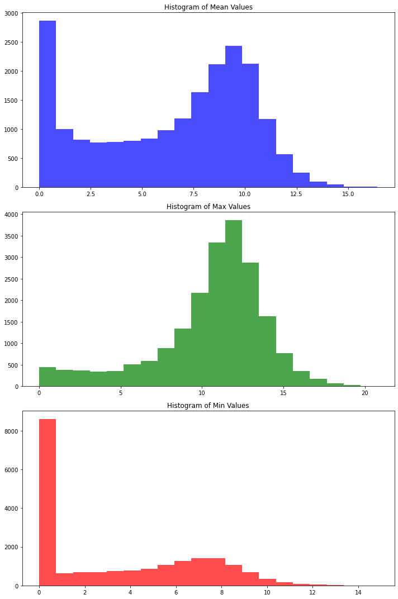
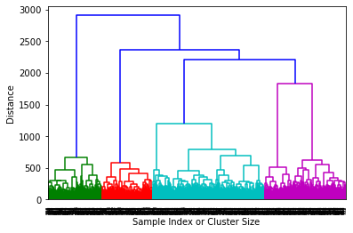
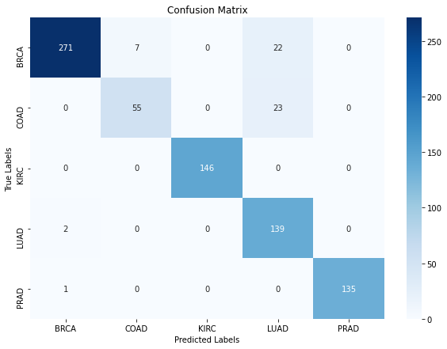
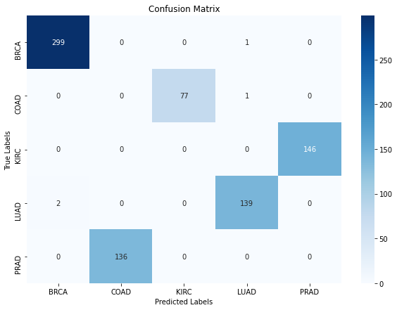
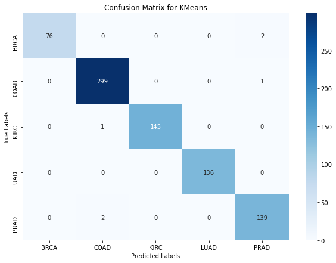
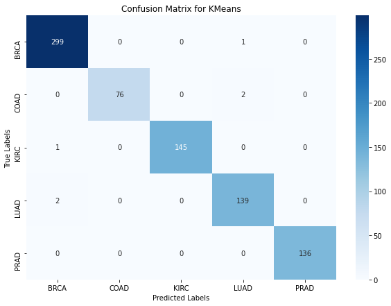
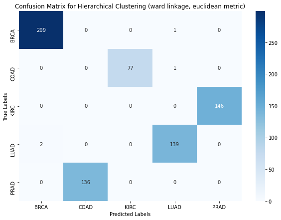
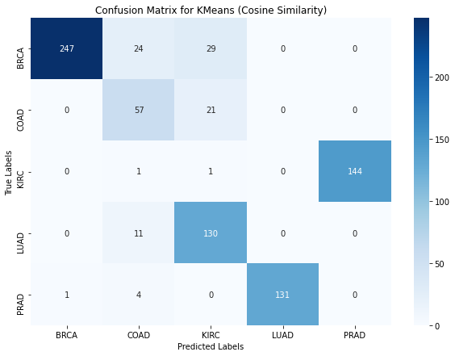
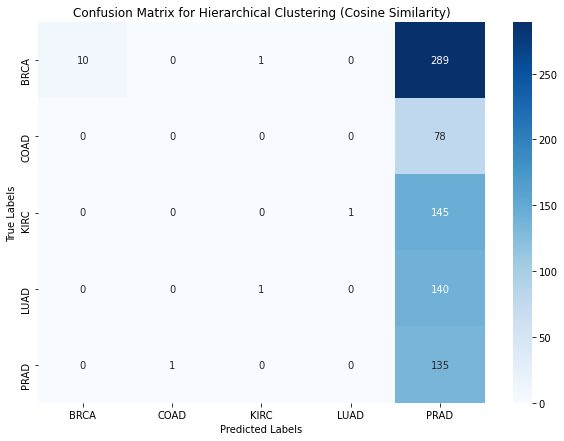

# Clustering RNA sequences to identify cancer types

In this assignment, we will use clustering algorithms on RNA sequence data to identify cancer types.
Since the [whole data](https://www.synapse.org/#!Synapse:syn4301332) (from [Cancer Genome Atlas Pan-Cancer project](https://www.ncbi.nlm.nih.gov/pmc/articles/PMC3919969/)) is very big, we will use a [subset data from UCI Machine Learning repository](https://archive.ics.uci.edu/ml/datasets/gene+expression+cancer+RNA-Seq#). The subset data contains only 5 labels; BRCA, KIRC, COAD, LUAD and PRAD. The meanings of those labels are as below.

|Abbreviation|Cancer|
|:----:|:-------:|
|LUSC|Lung squamous cell carcinoma |
|READ |Rectum adenocarcinoma |
|GBM |Glioblastoma multiforme|
|BLCA |Bladder Urothelial Carcinoma|
|UCEC |Uterine Corpus Endometrioid Carcinoma|
|COAD |Colon adenocarcinoma|
|OV |Ovarian serous cystadenocarcinoma|
|LAML |Acute Myeloid Leukemia|
|HNSC |Head and Neck squamous cell carcinoma|
|LUAD |Lung adenocarcinoma|
|BRCA |Breast invasive carcinoma|
|KIRC |Kidney renal clear cell carcinoma|

Although we can use the data for supervised learning model training, we will not use these labels for training, but use them for evaluation.


```python
import pandas as pd
import matplotlib.pyplot as plt
import numpy as np
from sklearn.cluster import AgglomerativeClustering, KMeans
from sklearn.metrics import accuracy_score, confusion_matrix
import time
```


```python
# Read data. Do not change the variable names (data, label)
data = pd.read_csv('data/data.csv')
label = pd.read_csv('data/labels.csv')
data=data.drop('Unnamed: 0',axis=1)
label=label.drop('Unnamed: 0',axis=1)
```

### A. [Peer Review] Perform basic data inspection or EDA on the pandas dataframe.
- How many observations?
- How many features?


```python
# perform basic data inspection such as getting the number of observations and number of features
# Get the number of observations and number of features
num_observations = data.shape[0]  # Rows represent observations
num_features = data.shape[1]      # Columns represent features

# Display the results
print(f"Number of observations: {num_observations}")
print(f"Number of features: {num_features}\n")

# Display the dataframe
print(f"Data Info: \n{data.info()}\n")
print(f"Few Rows Data: \n{data.head()}\n")
```

    Number of observations: 801
    Number of features: 20531
    
    <class 'pandas.core.frame.DataFrame'>
    RangeIndex: 801 entries, 0 to 800
    Columns: 20531 entries, gene_0 to gene_20530
    dtypes: float64(20531)
    memory usage: 125.5 MB
    Data Info: 
    None
    
    Few Rows Data: 
       gene_0    gene_1    gene_2    gene_3     gene_4  gene_5    gene_6  \
    0     0.0  2.017209  3.265527  5.478487  10.431999     0.0  7.175175   
    1     0.0  0.592732  1.588421  7.586157   9.623011     0.0  6.816049   
    2     0.0  3.511759  4.327199  6.881787   9.870730     0.0  6.972130   
    3     0.0  3.663618  4.507649  6.659068  10.196184     0.0  7.843375   
    4     0.0  2.655741  2.821547  6.539454   9.738265     0.0  6.566967   
    
         gene_7  gene_8  gene_9  ...  gene_20521  gene_20522  gene_20523  \
    0  0.591871     0.0     0.0  ...    4.926711    8.210257    9.723516   
    1  0.000000     0.0     0.0  ...    4.593372    7.323865    9.740931   
    2  0.452595     0.0     0.0  ...    5.125213    8.127123   10.908640   
    3  0.434882     0.0     0.0  ...    6.076566    8.792959   10.141520   
    4  0.360982     0.0     0.0  ...    5.996032    8.891425   10.373790   
    
       gene_20524  gene_20525  gene_20526  gene_20527  gene_20528  gene_20529  \
    0    7.220030    9.119813   12.003135    9.650743    8.921326    5.286759   
    1    6.256586    8.381612   12.674552   10.517059    9.397854    2.094168   
    2    5.401607    9.911597    9.045255    9.788359   10.090470    1.683023   
    3    8.942805    9.601208   11.392682    9.694814    9.684365    3.292001   
    4    7.181162    9.846910   11.922439    9.217749    9.461191    5.110372   
    
       gene_20530  
    0         0.0  
    1         0.0  
    2         0.0  
    3         0.0  
    4         0.0  
    
    [5 rows x 20531 columns]
    


- Draw histograms of mean, max and min values in each feature. You may see numbers around 0-20. What do those numbers mean? (We do not expect students to know or figure out the meanings, but if you do know by chance, feel free to discuss them with the class on the discussion board.) <br>
Answer the Peer Review question about this section. 


```python
# Calculate the mean, max, and min for each feature
mean_values = data.mean()
max_values = data.max()
min_values = data.min()

# Create histograms
fig, ax = plt.subplots(3, 1, figsize=(10, 15))

# Histogram of mean values
ax[0].hist(mean_values, bins=20, color='blue', alpha=0.7)
ax[0].set_title('Histogram of Mean Values')

# Histogram of max values
ax[1].hist(max_values, bins=20, color='green', alpha=0.7)
ax[1].set_title('Histogram of Max Values')

# Histogram of min values
ax[2].hist(min_values, bins=20, color='red', alpha=0.7)
ax[2].set_title('Histogram of Min Values')

# Show plots
plt.tight_layout()
plt.show()
```





- If we were to train a "supervised" learning model, how would you deal with such large feature dimension? 
- Even after feature dimension reduction, still the number of useful features may be enormous. How it would impact performance or runtime of certain supervised learning algorithms? Which algorithms would suffer from high dimension features than others and why? 
- How it would impact performance or runtime of an unsupervised learning algorithm?
- Draw histograms of mean, max and min values in each feature. You may see numbers around 0-20. What those numbers mean? (We do not expect students to know or figure out the meanings, but if you do know by chance, feel free to discuss them with the class on the discussion board.) <br> <br>
Anwer these questions in this week's Peer Review assignment. 

### B. [Peer Review] Build a hierarchical clustering model
Let's build a model using hierarchical clustering. Hierarchical clustering module is available from `sklearn.cluster.AgglomerativeClustering`. You can choose linkage type and metric. Please check its documentation for more details.

**a) Number of clusters vs distance threshold**
Oftentimes hierarchical clustering does not need to know the number of clusters in advance. Instead, one needs to choose threshold distance/similarity to cut the dendrogram later. The AgglomerativeClustering module lets you specify either the number of clusters (n_clusters) or the threshold (distance_threshold). Based on our data, which should we choose to set to which value and why? <br> <br>
Answer this question in the Peer Review assignment. 


```python
import scipy.cluster.hierarchy as sch

# Fit the model
model = AgglomerativeClustering(distance_threshold=0, n_clusters=None)
model = model.fit(data)

# Create linkage matrix
counts = np.zeros(model.children_.shape[0])
n_samples = len(model.labels_)
for i, merge in enumerate(model.children_):
    current_count = 0
    for child_idx in merge:
        if child_idx < n_samples:
            current_count += 1
        else:
            current_count += counts[child_idx - n_samples]
    counts[i] = current_count

linkage_matrix = np.column_stack([model.children_, model.distances_,
                                  counts]).astype(float)

# Plot the dendrogram
dendrogram = sch.dendrogram(linkage_matrix)
plt.xlabel('Sample Index or Cluster Size')
plt.ylabel('Distance')
plt.show()
```





#### b) Guess which metric?
Can you guess which metric to use (distance-based vs. similarity-based) and why? 
This question is not graded, but we encourage you to share your thoughts with the class. See the ungraded discussion prompt for this week's material. 

#### c) Build a model
Build a model using n_clusters=5 option. Choose any metric and linkage type at first. Display the clustering result labels (you can just print out the result). Do not change the variable (model) name. Answer the question about this section in the Peer Review.


```python
from sklearn.cluster import AgglomerativeClustering

# Assuming your DataFrame 'data' is already defined
model = AgglomerativeClustering(n_clusters=5, affinity='euclidean', linkage='complete')

# Fit the model
model.fit(data)

# Display the clustering result labels
print(model.labels_)
```

    [4 3 1 4 1 4 0 4 1 4 1 0 4 2 1 1 3 0 0 4 1 0 3 1 0 3 2 1 1 1 1 1 0 3 4 1 0
     3 1 3 0 4 4 0 0 1 4 2 1 3 1 3 1 4 2 1 1 3 0 1 3 0 1 3 4 2 1 4 0 1 0 1 1 3
     1 3 1 0 4 2 1 4 1 1 4 4 1 1 0 1 4 4 1 3 1 4 2 1 4 1 1 0 1 0 3 0 3 3 3 3 4
     1 3 4 1 0 0 0 1 1 3 0 3 1 4 4 4 1 0 1 2 1 2 1 1 0 3 1 0 2 1 4 1 0 3 2 4 1
     3 3 3 3 1 1 3 1 1 4 4 3 4 3 0 1 4 3 2 0 3 1 0 3 1 3 1 1 1 4 1 0 2 0 1 4 4
     4 3 3 1 3 3 0 3 4 3 1 3 1 3 3 1 0 0 0 0 4 2 4 1 3 3 1 4 1 4 1 1 1 3 1 0 3
     0 0 3 1 0 4 1 3 3 4 2 2 0 4 0 3 1 0 0 3 4 4 3 3 0 1 1 2 1 4 3 1 4 0 4 4 4
     1 3 2 3 2 3 4 3 1 1 0 0 1 2 4 0 4 1 1 0 1 1 1 2 3 3 1 1 1 0 0 0 0 3 1 1 0
     1 1 3 4 1 1 2 3 4 1 1 1 2 1 4 1 2 3 3 4 0 1 0 0 3 3 0 1 1 1 3 0 1 1 4 3 0
     1 3 4 0 1 4 2 1 1 1 3 3 3 1 1 4 3 1 0 1 2 3 3 1 0 1 1 1 2 3 2 0 4 0 1 1 0
     3 2 4 3 4 3 0 4 1 2 0 0 2 2 4 1 3 3 0 3 4 1 1 1 3 3 0 3 3 0 2 4 1 3 4 1 2
     1 3 1 1 4 1 4 2 1 3 1 1 3 1 1 1 0 3 4 1 4 0 1 0 2 1 4 3 0 1 1 0 1 3 3 1 4
     2 1 0 3 4 1 4 1 1 1 1 0 3 1 0 1 1 3 3 0 3 4 2 1 0 0 1 4 0 3 3 3 1 4 4 1 4
     3 0 4 1 3 4 3 1 1 2 3 0 2 3 1 4 1 1 4 1 2 1 2 0 1 1 3 3 3 3 0 3 3 1 1 0 4
     3 4 1 0 1 0 0 4 4 3 1 0 2 2 1 0 0 1 1 4 0 3 1 1 2 3 1 1 1 0 4 3 3 1 0 2 0
     0 1 4 3 0 1 2 3 3 3 4 3 0 1 1 2 4 3 1 1 0 3 3 1 4 3 3 1 0 4 2 3 4 2 3 2 0
     0 1 1 0 0 3 1 1 4 4 0 1 3 3 1 2 1 4 4 3 1 2 1 0 1 1 3 1 4 1 1 0 4 3 1 1 0
     3 1 1 1 2 2 3 3 3 1 1 4 1 1 0 3 3 0 0 3 0 2 1 2 0 1 1 4 4 4 3 4 4 2 1 1 3
     3 0 1 0 2 1 1 1 4 3 0 1 4 0 4 1 3 0 4 3 4 4 2 0 4 3 2 3 1 1 1 3 0 0 0 1 3
     0 4 1 3 4 1 4 1 0 1 3 4 4 0 4 0 1 3 3 1 3 0 1 1 1 1 0 0 4 3 0 3 3 0 1 3 1
     1 4 3 4 1 2 1 1 0 3 1 1 4 1 4 3 1 1 1 3 1 3 1 3 0 0 3 3 1 1 1 3 1 3 0 1 3
     0 3 3 3 0 1 4 1 1 0 1 4 0 1 1 1 1 4 3 1 3 3 4 4]


```python
import seaborn as sns
from sklearn.metrics import confusion_matrix
from scipy.optimize import linear_sum_assignment

# Get the true labels and predicted labels
true_labels = label.values.ravel()
predicted_labels = model.labels_

# Convert true labels to integer labels
label_to_int = {label: idx for idx, label in enumerate(np.unique(true_labels))}
int_true_labels = np.array([label_to_int[label] for label in true_labels])

# Compute the confusion matrix
cm = confusion_matrix(int_true_labels, predicted_labels)

# Use the Hungarian algorithm to find the best matching between clusters and true labels
row_ind, col_ind = linear_sum_assignment(-cm)

# Create a mapping from cluster labels to true labels
label_mapping = {col: row for row, col in zip(row_ind, col_ind)}

# Map the predicted labels to the true labels
mapped_labels = np.array([label_mapping[label] for label in predicted_labels])

# Compute the new confusion matrix after mapping
cm_mapped = confusion_matrix(int_true_labels, mapped_labels)

# Plot the confusion matrix
plt.figure(figsize=(10, 7))
sns.heatmap(cm_mapped, annot=True, fmt='d', cmap='Blues', xticklabels=np.unique(true_labels), yticklabels=np.unique(true_labels))
plt.xlabel('Predicted Labels')
plt.ylabel('True Labels')
plt.title('Confusion Matrix')
plt.show()

# Print the label mapping and accuracy
accuracy = np.trace(cm_mapped) / np.sum(cm_mapped)
print("Label mapping:", label_mapping)
print("Accuracy:", accuracy)
```





    Label mapping: {1: 0, 2: 1, 0: 2, 3: 3, 4: 4}
    Accuracy: 0.9313358302122348


#### d) Label permuation
In clustering, the labels get assigned randomly, so the label numbering won't match the ground truth necessarily. Write a function below to find best matching label ordering based on the accuracy. Do not change the variable names. Answer the question about this section in the Peer Review. 


```python
import itertools
from scipy.optimize import linear_sum_assignment

def label_permute_compare(ytdf,yp,n=5):
    """
    ytdf: labels dataframe object
    yp: clustering label prediction output
    Returns permuted label order and accuracy. 
    Example output: (3, 4, 1, 2, 0), 0.74 
    """
    # Extract true labels
    true_labels = ytdf.iloc[:, 0].values
    
    # Generate all possible permutations of label indices
    perms = list(itertools.permutations(range(n)))
    best_accuracy = 0
    best_perm = None
    
    # Evaluate each permutation
    for perm in perms:
        # Create a mapping dictionary from original labels to permuted labels
        mapdict = dict(zip(np.unique(true_labels), perm))
        
        # Apply the permutation to the true labels
        permuted_labels = np.array([mapdict[label] for label in true_labels])
        
        # Calculate accuracy for this permutation
        acc = accuracy_score(permuted_labels, yp)
        
        # Update the best permutation if this accuracy is higher
        if acc > best_accuracy:
            best_accuracy = acc
            best_perm = perm
    
    return best_perm, best_accuracy
```


```python
labelorder, acc = label_permute_compare(label, model.labels_)
print(labelorder, acc)
```

    (1, 2, 0, 3, 4) 0.9313358302122348


#### e) Check confusion matrix
Use sklearn's confusion matrix and display the results. Answer the Peer Review question about this section.  


```python
# Map model.labels_ to the best permutation
mapped_labels = np.array([labelorder[label] for label in model.labels_])

# Convert integer mapped labels back to string labels
int_to_label = {v: k for k, v in label_to_int.items()}
mapped_labels_str = np.array([int_to_label[label] for label in mapped_labels])

# Compute confusion matrix
cm = confusion_matrix(label.values.ravel(), mapped_labels_str)

print(f"Confusion Matrix:\n{cm}\n")

# Plot confusion matrix
plt.figure(figsize=(10, 7))
sns.heatmap(cm, annot=True, fmt='d', cmap='Blues', xticklabels=np.unique(label.values.ravel()), yticklabels=np.unique(label.values.ravel()))
plt.xlabel('Predicted Labels')
plt.ylabel('True Labels')
plt.title('Confusion Matrix')
plt.show()
```

    Confusion Matrix:
    [[299   0   0   1   0]
     [  0   0  77   1   0]
     [  0   0   0   0 146]
     [  2   0   0 139   0]
     [  0 136   0   0   0]]
    





#### f) Change linkage method and distance metric. Which ones lead the best performance? Print out the accuracy and confusion matrix for the best model.
<br> Answer the Peer Review questions about this section. 


```python
# programmatically evaluate which linkage method and distance metric lead to the best performance
from sklearn.metrics import accuracy_score

# Define possible linkage methods and distance metrics
linkage_methods = ['complete', 'average', 'single', 'ward']
distance_metrics = ['euclidean', 'manhattan', 'cosine']

# Track the best performance
best_accuracy = 0
best_linkage = None
best_metric = None
best_model_labels = None
best_label_mapping = None

# Loop through each combination of linkage methods and distance metrics
for linkage in linkage_methods:
    for metric in distance_metrics:
        if linkage == 'ward' and metric != 'euclidean':
            continue  # Ward linkage only works with Euclidean distance
        # Fit the model with the current combination
        model = AgglomerativeClustering(n_clusters=5, affinity=metric, linkage=linkage)
        model.fit(data)
        
        # Get the predicted labels
        predicted_labels = model.labels_
        
        # Evaluate performance using label_permute_compare function
        labelorder, acc = label_permute_compare(label, predicted_labels, n=5)
        
        # Update the best performance if current accuracy is higher
        if acc > best_accuracy:
            best_accuracy = acc
            best_linkage = linkage
            best_metric = metric
            best_model_labels = predicted_labels
            best_label_mapping = labelorder

print(f"Best linkage method: {best_linkage}")
print(f"Best distance metric: {best_metric}")
print(f"Best accuracy: {best_accuracy}")

# Invert the label mapping to map integers back to string labels
int_to_label = {v: k for k, v in label_to_int.items()}
mapped_labels_str = np.array([int_to_label[best_label_mapping[label]] for label in best_model_labels])

# Ensure mapped_labels are used in their correct type
mapped_labels = np.array([best_label_mapping[label] for label in best_model_labels])

# Compute confusion matrix
cm = confusion_matrix(label.values.ravel(), mapped_labels_str)

# Plot confusion matrix
plt.figure(figsize=(10, 7))
sns.heatmap(cm, annot=True, fmt='d', cmap='Blues', xticklabels=range(5), yticklabels=range(5))
plt.xlabel('Predicted Labels')
plt.ylabel('True Labels')
plt.title('Confusion Matrix')
plt.show()
```

    Best linkage method: ward
    Best distance metric: euclidean
    Best accuracy: 0.9950062421972534


### C. What about k-means clustering?
Can we apply kmeans clustering on this data? Which clustering methods give a better performance? Is kmeans faster or slower?


```python
import time
import numpy as np
from sklearn.cluster import KMeans
from sklearn.metrics import confusion_matrix
import matplotlib.pyplot as plt
import seaborn as sns

# Timing KMeans clustering
t0 = time.time()
kmeans = KMeans(n_clusters=5, random_state=42).fit(data)
t1 = time.time()
kmeans_time = t1 - t0
print(f"KMeans clustering time: {kmeans_time:.4f} seconds")

# Get the best label permutation and accuracy
labelorder, acc = label_permute_compare(label, kmeans.labels_)
print(f"Label order: {labelorder}, Accuracy: {acc}")

# Map true labels to predicted labels using the best permutation
mapdict = dict(zip(np.unique(label['Class']), labelorder))
yt = label['Class'].apply(lambda x: mapdict[x])

# Compute confusion matrix
cm = confusion_matrix(yt, kmeans.labels_)

# Plot confusion matrix
plt.figure(figsize=(10, 7))
sns.heatmap(cm, annot=True, fmt='d', cmap='Blues', xticklabels=np.unique(label['Class']), yticklabels=np.unique(label['Class']))
plt.xlabel('Predicted Labels')
plt.ylabel('True Labels')
plt.title('Confusion Matrix for KMeans')
plt.show()

# Print the final accuracy
print(f"KMeans clustering accuracy: {acc}")
```

    KMeans clustering time: 10.2944 seconds
    Label order: (1, 0, 2, 4, 3), Accuracy: 0.9925093632958801





    KMeans clustering accuracy: 0.9925093632958801


Below code performs clustering on a dataset using both KMeans and hierarchical clustering methods and evaluates their performance. It first applies KMeans clustering, records the time taken, and calculates the clustering accuracy using a custom function (`label_permute_compare`) to find the best permutation of labels. It then maps the KMeans labels back to the original class labels, computes the confusion matrix, and plots it. 

Next, it applies the previously identified best hierarchical clustering method (with optimal linkage and metric), records the time taken, and repeats the process of mapping, computing the confusion matrix, and plotting it. 

Finally, it prints the accuracy and runtime for both clustering methods, allowing a comparison of their performance in terms of accuracy and execution time.


```python
from sklearn.cluster import KMeans
import time

# Time and apply KMeans clustering
start_time = time.time()
kmeans = KMeans(n_clusters=5, random_state=42)
kmeans_labels = kmeans.fit_predict(data)
kmeans_time = time.time() - start_time

# Evaluate performance using label_permute_compare function for KMeans
kmeans_labelorder, kmeans_acc = label_permute_compare(label, kmeans_labels, n=5)

# Invert the label mapping to map integers back to string labels
int_to_label = {v: k for k, v in label_to_int.items()}
kmeans_mapped_labels_str = np.array([int_to_label[kmeans_labelorder[label]] for label in kmeans_labels])

# Compute confusion matrix for KMeans
kmeans_cm = confusion_matrix(label.values.ravel(), kmeans_mapped_labels_str)

# Plot confusion matrix for KMeans
plt.figure(figsize=(10, 7))
sns.heatmap(kmeans_cm, annot=True, fmt='d', cmap='Blues', xticklabels=np.unique(label.values.ravel()), yticklabels=np.unique(label.values.ravel()))
plt.xlabel('Predicted Labels')
plt.ylabel('True Labels')
plt.title('Confusion Matrix for KMeans')
plt.show()

print(f"KMeans Accuracy: {kmeans_acc}")
print(f"KMeans Time: {kmeans_time:.4f} seconds")

# Time and apply the best hierarchical clustering method found previously
start_time = time.time()
best_hierarchical_model = AgglomerativeClustering(n_clusters=5, affinity=best_metric, linkage=best_linkage)
best_hierarchical_model.fit(data)
hierarchical_time = time.time() - start_time

# Use previously found best permutation for hierarchical clustering
hierarchical_mapped_labels_str = np.array([int_to_label[best_label_mapping[label]] for label in best_hierarchical_model.labels_])

# Compute confusion matrix for hierarchical clustering
hierarchical_cm = confusion_matrix(label.values.ravel(), hierarchical_mapped_labels_str)

# Plot confusion matrix for hierarchical clustering
plt.figure(figsize=(10, 7))
sns.heatmap(hierarchical_cm, annot=True, fmt='d', cmap='Blues', xticklabels=np.unique(label.values.ravel()), yticklabels=np.unique(label.values.ravel()))
plt.xlabel('Predicted Labels')
plt.ylabel('True Labels')
plt.title(f'Confusion Matrix for Hierarchical Clustering ({best_linkage} linkage, {best_metric} metric)')
plt.show()

print(f"Hierarchical Clustering Accuracy: {best_accuracy}")
print(f"Hierarchical Clustering Time: {hierarchical_time:.4f} seconds")
```





    KMeans Accuracy: 0.9925093632958801
    KMeans Time: 10.1510 seconds





    Hierarchical Clustering Accuracy: 0.9950062421972534
    Hierarchical Clustering Time: 6.3925 seconds


To use similarity-based metrics, we will adjust the code to include similarity-based metrics such as "cosine". The AgglomerativeClustering in sklearn supports the "cosine" metric, but KMeans does not directly support cosine distance. For KMeans, we will use the cosine similarity transformation manually.

Summary of Changes:
- Cosine Transformation: For KMeans, the data is transformed using cosine_distances.
- Hierarchical Clustering: Use affinity='cosine' and linkage='average' for the best hierarchical model.
- Confusion Matrix Plotting: Updated titles to reflect the use of cosine similarity.


```python
from sklearn.cluster import KMeans
from sklearn.metrics.pairwise import cosine_distances
import time

# Time and apply KMeans clustering using cosine similarity
start_time = time.time()
cosine_transformed_data = cosine_distances(data)
kmeans = KMeans(n_clusters=5, random_state=42)
kmeans_labels = kmeans.fit_predict(cosine_transformed_data)
kmeans_time = time.time() - start_time

# Evaluate performance using label_permute_compare function for KMeans
kmeans_labelorder, kmeans_acc = label_permute_compare(label, kmeans_labels, n=5)

# Invert the label mapping to map integers back to string labels
int_to_label = {v: k for k, v in {label: idx for idx, label in enumerate(np.unique(label.values.ravel()))}.items()}
kmeans_mapped_labels_str = np.array([int_to_label[kmeans_labelorder[label]] for label in kmeans_labels])

# Compute confusion matrix for KMeans
kmeans_cm = confusion_matrix(label.values.ravel(), kmeans_mapped_labels_str)

# Plot confusion matrix for KMeans
plt.figure(figsize=(10, 7))
sns.heatmap(kmeans_cm, annot=True, fmt='d', cmap='Blues', xticklabels=np.unique(label.values.ravel()), yticklabels=np.unique(label.values.ravel()))
plt.xlabel('Predicted Labels')
plt.ylabel('True Labels')
plt.title('Confusion Matrix for KMeans (Cosine Similarity)')
plt.show()

print(f"KMeans Accuracy: {kmeans_acc}")
print(f"KMeans Time: {kmeans_time:.4f} seconds")

# Time and apply the best hierarchical clustering method found previously using cosine similarity
start_time = time.time()
best_hierarchical_model = AgglomerativeClustering(n_clusters=5, affinity='cosine', linkage='average')
best_hierarchical_model.fit(data)
hierarchical_time = time.time() - start_time

# Use previously found best permutation for hierarchical clustering
hierarchical_mapped_labels_str = np.array([int_to_label[best_label_mapping[label]] for label in best_hierarchical_model.labels_])

# Compute confusion matrix for hierarchical clustering
hierarchical_cm = confusion_matrix(label.values.ravel(), hierarchical_mapped_labels_str)

# Plot confusion matrix for hierarchical clustering
plt.figure(figsize=(10, 7))
sns.heatmap(hierarchical_cm, annot=True, fmt='d', cmap='Blues', xticklabels=np.unique(label.values.ravel()), yticklabels=np.unique(label.values.ravel()))
plt.xlabel('Predicted Labels')
plt.ylabel('True Labels')
plt.title('Confusion Matrix for Hierarchical Clustering (Cosine Similarity)')
plt.show()

print(f"Hierarchical Clustering Accuracy: {best_accuracy}")
print(f"Hierarchical Clustering Time: {hierarchical_time:.4f} seconds")
```





    KMeans Accuracy: 0.885143570536829
    KMeans Time: 2.7437 seconds





    Hierarchical Clustering Accuracy: 0.9950062421972534
    Hierarchical Clustering Time: 6.3831 seconds

